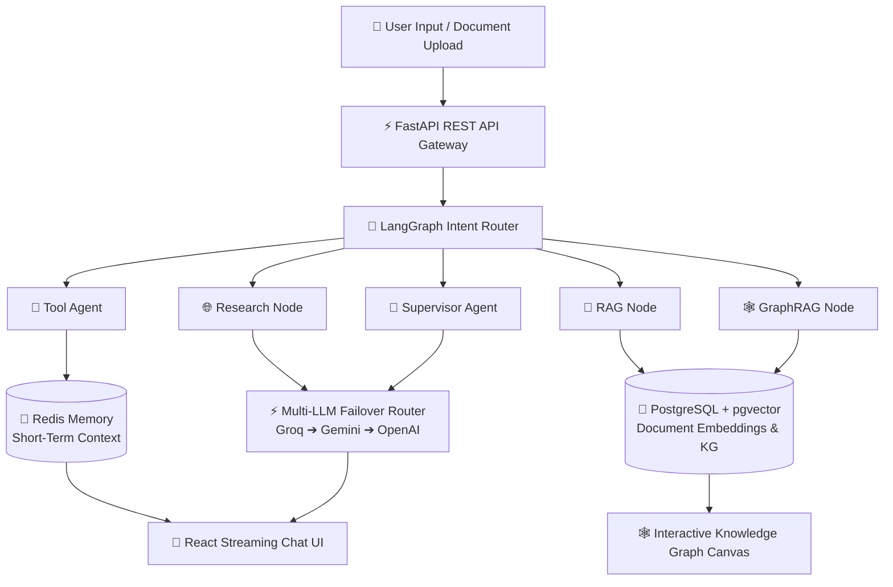
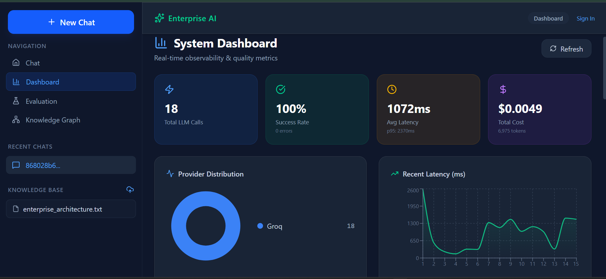
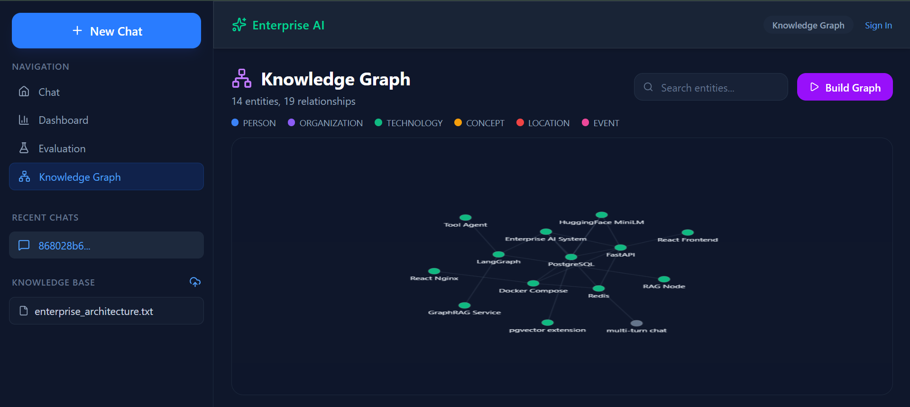
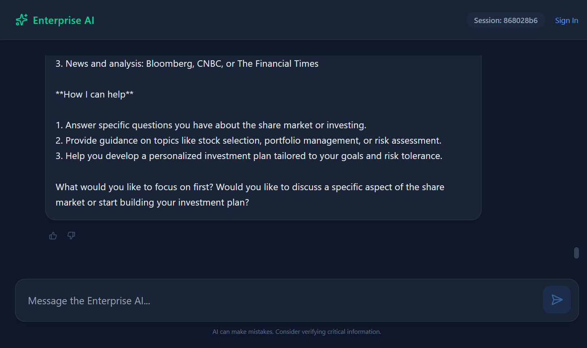
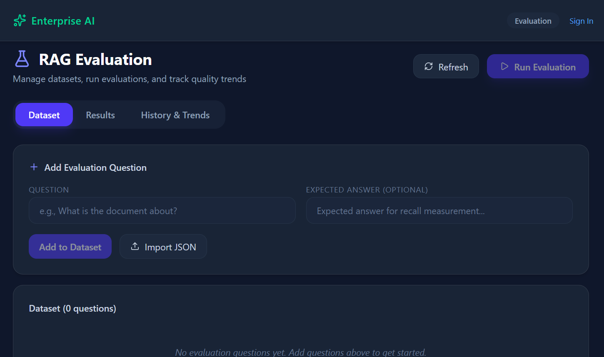
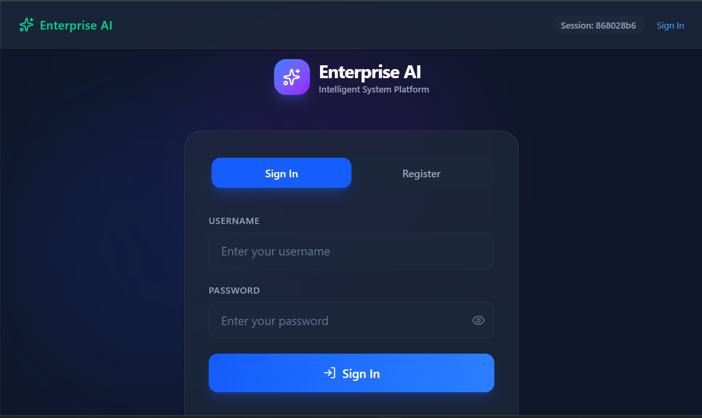
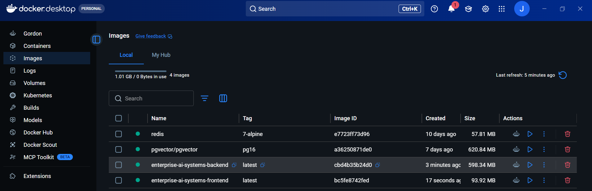

# 🚀 Enterprise AI System — Production Autonomous Multi-Agent Platform

[](https://www.linkedin.com/in/jaydeep-parmar-19479a274/)
[](https://fastapi.tiangolo.com)
[](https://langchain.com)
[](https://www.postgresql.org)
[](https://redis.io)
[](https://www.docker.com)
[](https://reactjs.org)

An **Enterprise-Grade Autonomous Multi-Agent AI Platform** built with **LangGraph**, **FastAPI**, **PostgreSQL (`pgvector`)**, **Redis**, and **React (Vite + Nginx)**. 

Featuring **Role-Based Autonomous Agents**, **Multi-Modal Memory (Short-Term Redis + Long-Term Vector RAG)**, **Hybrid Knowledge Graph RAG**, **Multi-LLM Failover Routing**, **Bcrypt Database Security**, and **Docker Microservice Containerization**.

---

## 🏗️ System Architecture & End-to-End Data Flow

The platform implements an asynchronous, decoupled microservice architecture spanning from the user interface layer down to vector database indexing and multi-LLM failover routing.



---

## 🔥 Key Technical Highlights & Features

### 1. 🤖 **Role-Based Autonomous Agents (LangGraph Orchestration)**
- 🧮 **`ToolAgent`**: Handles math expressions, pronoun anaphoras (`"add it with 5"`), and chained state calculations.
- 🌐 **`ResearchAgent`**: Scrapes web sources and extracts live search information.
- 📄 **`RAGAgent`**: Executes 384-dimensional vector similarity retrieval over HuggingFace embeddings (`all-MiniLM-L6-v2`).
- 🎯 **`SupervisorAgent`**: Orchestrates complex multi-step planning and subagent tasks.
- 💡 **`BrainstormAgent`**: Generates creative ideation and strategic recommendations.
- 🕸️ **`GraphRAGService`**: Performs hybrid Knowledge Graph entity traversals combined with vector retrieval.
- 💬 **`GeneralAgent`**: Direct LLM fast-path for general conversational queries.

### 2. 🧠 **Multi-Modal Memory Architecture**
- **Short-Term State (`Redis`)**: Fast conversation history buffering and multi-turn session locking.
- **Long-Term Storage (`PostgreSQL + pgvector`)**: Stores raw text chunks, 384d dense embeddings, and relational entity graphs.
- **Pronoun Anaphora Resolution**: Contextually extracts previous calculation results across turns.

### 3. 🕸️ **Hybrid Knowledge Graph (GraphRAG)**
- **Automated Entity Extraction**: Extracts named entities (`TECHNOLOGY`, `ORGANIZATION`, `CONCEPT`) and directional edges (`USES`, `CONTAINERIZES`, `DEPENDS_ON`).
- **NetworkX & DB Synchronization**: Dual persistence in PostgreSQL (`kg_nodes`, `kg_edges`) and NetworkX.
- **Interactive Force-Directed UI**: Live graph visualization canvas with real-time node filtering.

### 4. 🔁 **Multi-LLM Failover Router**
- **High Availability**: Primary routing to Groq Llama-3 with automatic fallback to Gemini 1.5 and OpenRouter/OpenAI.
- **Zero Downtime**: Real-time provider health probes and rate-limit mitigation.

### 5. 🛡️ **Bcrypt Security & Database Auth**
- **Native Salt Hashing**: Password hashing using direct `bcrypt` salt generation (`gensalt()` & `hashpw()`).
- **PostgreSQL User Store**: Persistent user accounts stored in indexed database tables.
- **JWT Authorization**: Cryptographically signed JSON Web Tokens for route authentication.

---

## 📁 Repository Folder Structure

```
enterprise-ai-systems/
├── backend/                        # FastAPI Backend Service
│   ├── app/
│   │   ├── agents/                 # Role-Based Autonomous Agents (Tool, RAG, Research, etc.)
│   │   ├── api/v1/                 # REST API Endpoints (Chat, Auth, Knowledge Graph, Metrics)
│   │   ├── core/                   # Security, Config, Logger, and Tracing
│   │   ├── db/                     # PostgreSQL Engine & Redis Client Connections
│   │   ├── evaluation/             # Agent Evaluator & Metrics Collectors
│   │   ├── graph/                  # LangGraph Workflow StateGraph Definitions
│   │   ├── knowledge_graph/        # Entity Extractor, Graph Store & GraphRAG Service
│   │   ├── models/                 # SQLAlchemy Database Models (User, Document, KG)
│   │   └── services/               # Multi-LLM Provider Failover Service
│   ├── sample_docs/                # Sample Documents for RAG and Knowledge Graph Ingestion
│   ├── Dockerfile                  # Production Backend Container Image Specs
│   ├── requirements.txt            # Python Dependencies
│   └── run_local.py                # Local Development Uvicorn Launcher
├── frontend/                       # React (Vite + Nginx) Web Dashboard
│   ├── public/                     # Favicons & Static Assets
│   ├── src/
│   │   ├── components/             # UI Views (ChatWindow, KnowledgeGraphPage, DashboardPage, AuthPage)
│   │   ├── services/               # Axios API Client Integration
│   │   └── App.tsx                 # Main Navigation & State Management
│   └── Dockerfile                  # Multi-Stage Nginx Build Specs
├── docs/                           # Documentation & Interface Screenshots
│   └── images/                     # Platform Dashboards & Container Screenshots
├── .dockerignore                   # Build Context Transfer Optimization
├── docker-compose.yml              # Multi-Container Microservice Orchestration
└── README.md                       # Main Project Documentation
```

---

## 📸 Platform Interface Screenshots & Dashboards

### 1. 📊 System Observability & Metrics Dashboard


### 2. 🕸️ Interactive Knowledge Graph Canvas


### 3. 💬 Multi-Agent Streaming Chat Interface


### 4. 🔬 RAG Quality & Evaluation Dashboard


### 5. 🛡️ Bcrypt & JWT User Authentication


### 6. 🐳 Docker Desktop Microservice Status


---

## 🚀 Quickstart & Installation

### Option A: Running with Docker Compose (Recommended)

```powershell
# 1. Clone the repository
git clone https://github.com/Jaydeep0832/Enterprise-AI-System.git
cd Enterprise-AI-System

# 2. Build and start all microservices in detached mode
docker-compose up --build -d

# 3. Verify running containers
docker-compose ps
```

Access services:
- **Frontend Dashboard**: [http://localhost:3000](http://localhost:3000)
- **Backend REST API**: [http://localhost:8000/api/v1/health](http://localhost:8000/api/v1/health)

---

### Option B: Running Locally

#### 1. Backend Setup
```powershell
cd backend
python -m venv venv
venv\Scripts\activate      # On Windows
pip install -r requirements.txt
python run_local.py
```

#### 2. Frontend Setup
```powershell
cd frontend
npm install
npm run dev
```

---

## 🔮 Future Roadmap & Enhancements

- 🌐 **Public Cloud Deployment**: Terraform scripts for AWS ECS (Fargate), Kubernetes (EKS), and Railway multi-region deployment.
- ⚡ **Real-Time Streaming**: Server-Sent Events (SSE) & WebSocket protocol for instant token-by-token streaming.
- 🔒 **Enterprise RBAC & OAuth2**: Google & GitHub OAuth2 single sign-on with role-based permission control.
- 📈 **Advanced Observability**: OpenTelemetry tracing integration with LangSmith and Grafana dashboards.

---

## 👨‍💻 Author & Maintainer

Architected and developed with ❤️ by **Jaydeep Parmar**

* 🔗 **LinkedIn**: [Jaydeep Parmar](https://www.linkedin.com/in/jaydeep-parmar-19479a274/)
* 🐙 **GitHub**: [@Jaydeep0832](https://github.com/Jaydeep0832)

---

## 📜 License

Distributed under the **MIT License**. See `LICENSE` for details.