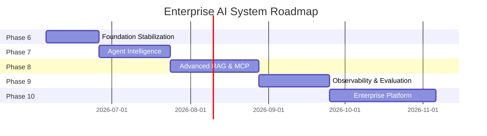

# Enterprise AI System — Project Roadmap

> **Date:** 2026-06-04  
> **Phase:** 5 — Roadmap Generation  
> **Scope:** Phases 6 through 10

---

## Phase 6: Foundation Stabilization & Core Pipeline Completion

### Objective
Fix all critical bugs, eliminate technical debt, complete the document upload pipeline, and wire the existing architecture together properly.

### Why It Matters
You cannot build advanced features on a broken foundation. Every bug fixed now prevents cascading failures later. This phase also teaches debugging, API design, and system integration — skills used daily in production AI engineering.

### Learning Outcome
- How to audit and stabilize an AI system
- API contract design and testing
- Security-first engineering (replacing `eval()`)
- Session management in AI applications
- Proper dependency management

### Technical Outcome
- All critical bugs fixed (RAGAgent, eval(), memory singleton)
- LangGraph workflow integrated into `/chat` API
- Session-based memory with Redis in the chat flow
- Complete document upload pipeline with metadata
- Document management API (list, delete, search)
- Proper `requirements.txt` with all dependencies
- Basic pytest test suite replacing manual scripts
- Resolved git merge conflict

### Dependencies
- PostgreSQL running with pgvector extension
- Redis running
- At least one LLM provider API key

### Estimated Effort
**2-3 weeks**

### Risk Level
🟢 **Low** — Well-understood changes, mostly fixing known issues

### Milestones

| # | Milestone | Effort |
|---|---|---|
| 6.1 | Fix RAGAgent method name bug | 1 hour |
| 6.2 | Replace `eval()` with safe math parser | 2 hours |
| 6.3 | Integrate LangGraph into /chat API | 1 day |
| 6.4 | Wire RedisMemory into chat with session IDs | 1 day |
| 6.5 | Fix memory_node / save_memory_node and add to graph | 1 day |
| 6.6 | Consolidate duplicate ingestion services | 2 hours |
| 6.7 | Complete document upload with metadata + management API | 3 days |
| 6.8 | Regenerate requirements.txt | 1 hour |
| 6.9 | Remove dead code (unused providers, state.py, etc.) | 2 hours |
| 6.10 | Convert test scripts to pytest with assertions | 3 days |
| 6.11 | Add Alembic migrations | 1 day |
| 6.12 | Add Dockerfile and docker-compose | 1 day |

---

## Phase 7: Agent Intelligence & Tool Framework

### Objective
Build the foundational agent patterns: Agent Planner, Agent Executor, Skills Framework, and real tool implementations. Transform agents from single-shot responders to autonomous problem solvers.

### Why It Matters
This is the heart of modern AI engineering. The ReAct pattern, tool-use loops, and skills architecture are what separate toy chatbots from production AI agents. Every major AI platform (LangChain, CrewAI, AutoGen) is built on these patterns.

### Learning Outcome
- ReAct (Reason + Act) agent pattern
- Plan-and-Execute architecture
- Tool-use iteration loops
- Plugin/skills architecture design
- Dynamic capability discovery
- Agent safety guardrails

### Technical Outcome
- Agent Planner that decomposes complex tasks into sub-steps
- Agent Executor with iterative tool-use loops
- Skills Framework with skill descriptors, versioning, and dynamic loading
- Real Web Search tool implementation (Tavily or Brave Search API)
- File manipulation tools (read, write, summarize)
- Code execution tool (sandboxed)
- Tool result validation and error recovery
- Agent execution tracing and logging
- Max iteration and token budget guardrails

### Dependencies
- Phase 6 complete (stable foundation)
- External API keys for search tools

### Estimated Effort
**3-4 weeks**

### Risk Level
🟡 **Medium** — New architectural patterns, requires careful design

### Milestones

| # | Milestone | Effort |
|---|---|---|
| 7.1 | Design Skills Framework (descriptors, registry, loader) | 2 days |
| 7.2 | Implement Web Search tool (Tavily/Brave) | 1 day |
| 7.3 | Implement File tools (read, summarize) | 1 day |
| 7.4 | Build Agent Executor with tool-use loop | 3 days |
| 7.5 | Build Agent Planner with task decomposition | 3 days |
| 7.6 | Integrate planner + executor in LangGraph | 2 days |
| 7.7 | Add safety guardrails (max iterations, forbidden actions) | 1 day |
| 7.8 | Add agent execution tracing | 2 days |
| 7.9 | Build Brainstorming Agent using skills | 2 days |
| 7.10 | Update frontend with agent status display | 2 days |

---

## Phase 8: Advanced RAG, Memory & MCP

### Objective
Elevate the RAG pipeline to production quality with hybrid search and multi-document support. Implement advanced memory tiers. Build the MCP Server to expose the system as a standardized AI tool provider.

### Why It Matters
These are the differentiators between a demo and a real AI system. Hybrid search dramatically improves retrieval quality. Advanced memory enables persistent, personalized AI. MCP is the emerging standard for AI tool interoperability — understanding it now is a significant career advantage.

### Learning Outcome
- MCP specification and implementation
- Hybrid search engineering (BM25 + vector + fusion)
- Multi-tier memory architectures
- Memory consolidation and retrieval strategies
- RAG quality optimization
- Document collection management

### Technical Outcome
- MCP Server exposing tools, resources, and prompts
- MCP Client for consuming external tool servers
- Hybrid search (PostgreSQL tsvector + pgvector + RRF)
- Multi-document RAG with collection management
- Source attribution in RAG answers
- Advanced memory system (working → short-term → long-term)
- Memory consolidation (periodic summarization)
- Semantic memory with entity extraction
- Cross-session user memory

### Dependencies
- Phase 7 complete (skills framework for MCP tools)
- PostgreSQL full-text search support

### Estimated Effort
**4-5 weeks**

### Risk Level
🟡 **Medium** — MCP is newer protocol, may need spec updates

### Milestones

| # | Milestone | Effort |
|---|---|---|
| 8.1 | Implement MCP Server (JSON-RPC + SSE transport) | 4 days |
| 8.2 | Expose existing tools via MCP | 2 days |
| 8.3 | Build MCP Client for external servers | 3 days |
| 8.4 | Add BM25 full-text search to PostgreSQL | 2 days |
| 8.5 | Implement Reciprocal Rank Fusion | 1 day |
| 8.6 | Add document collections and metadata filtering | 2 days |
| 8.7 | Add source attribution to RAG responses | 1 day |
| 8.8 | Build multi-tier memory system | 4 days |
| 8.9 | Implement memory consolidation | 2 days |
| 8.10 | Add semantic memory with entity extraction | 3 days |
| 8.11 | Update frontend with document management UI | 3 days |

---

## Phase 9: Observability, Evaluation & Quality

### Objective
Build comprehensive observability, evaluation, and quality assurance systems. Make the AI system debuggable, measurable, and continuously improving.

### Why It Matters
You can't improve what you can't measure. Production AI systems fail in subtle ways — retrieval returns irrelevant documents, LLMs hallucinate, agents get stuck in loops. Without observability and evaluation, these failures go undetected. This phase teaches the "last mile" of AI engineering that separates hobbyists from professionals.

### Learning Outcome
- AI system observability patterns
- LLM evaluation metrics and frameworks
- RAG quality measurement (RAGAS)
- Automated regression detection
- Human-in-the-loop feedback systems
- Cost and performance optimization

### Technical Outcome
- LangSmith or Arize Phoenix integration for LLM tracing
- LLM call monitoring (latency, tokens, cost per call)
- RAG evaluation pipeline (Faithfulness, Relevancy, Context Precision)
- Agent evaluation (task completion rate, tool use efficiency)
- Evaluation dataset management
- Human feedback collection (thumbs up/down + annotations)
- Quality trend dashboards
- Automated alerts for quality degradation
- Cost tracking and optimization recommendations

### Dependencies
- Phase 8 complete (needs full system to evaluate)
- LangSmith API key (or self-hosted Phoenix)

### Estimated Effort
**3-4 weeks**

### Risk Level
🟡 **Medium** — Evaluation is nuanced, requires iteration on metrics

### Milestones

| # | Milestone | Effort |
|---|---|---|
| 9.1 | Integrate LangSmith/Phoenix for tracing | 2 days |
| 9.2 | Add LLM call metrics (latency, tokens, cost) | 1 day |
| 9.3 | Build RAG evaluation pipeline with RAGAS | 3 days |
| 9.4 | Create evaluation datasets | 2 days |
| 9.5 | Add agent execution evaluation | 2 days |
| 9.6 | Build human feedback collection UI | 2 days |
| 9.7 | Implement feedback-driven prompt refinement | 2 days |
| 9.8 | Build quality dashboards | 3 days |
| 9.9 | Add automated regression alerts | 1 day |
| 9.10 | Cost tracking and optimization | 2 days |

---

## Phase 10: Enterprise Platform & Knowledge Intelligence

### Objective
Transform the system into a true enterprise AI platform with Knowledge Graph intelligence, visual workflow builder, multi-agent collaboration, production deployment, and comprehensive documentation.

### Why It Matters
This is the capstone phase. Knowledge Graphs enable structured reasoning that pure LLMs cannot do. Workflow builders make AI accessible to non-technical users. Multi-agent collaboration enables complex, multi-domain problem solving. Production deployment teaches real-world DevOps for AI systems.

### Learning Outcome
- Knowledge Graph construction and reasoning
- GraphRAG (graph-augmented retrieval)
- Multi-agent collaboration protocols
- Visual workflow design
- Production AI deployment (Docker, Kubernetes)
- CI/CD for AI systems
- API gateway and rate limiting
- Comprehensive system documentation

### Technical Outcome
- Knowledge Graph with Neo4j or NetworkX
- Entity and relationship extraction from documents
- GraphRAG combining graph + vector retrieval
- Visual workflow builder (drag-and-drop in frontend)
- Multi-agent collaboration (specialist agents communicating)
- Research Workspace with multi-source synthesis
- Production Docker deployment with health checks
- CI/CD pipeline (GitHub Actions)
- API rate limiting and authentication
- Comprehensive README and API documentation
- Architecture decision records (ADRs)

### Dependencies
- Phase 9 complete (need evaluation to validate quality)
- Neo4j or equivalent graph database
- Domain name and hosting for deployment

### Estimated Effort
**5-6 weeks**

### Risk Level
🔴 **High** — Complex integration of many systems, requires careful architecture

### Milestones

| # | Milestone | Effort |
|---|---|---|
| 10.1 | Neo4j setup and entity extraction pipeline | 3 days |
| 10.2 | Build Knowledge Graph from ingested documents | 3 days |
| 10.3 | Implement GraphRAG queries | 2 days |
| 10.4 | Knowledge Graph visualization (frontend) | 3 days |
| 10.5 | Build Research Workspace with multi-source synthesis | 4 days |
| 10.6 | Multi-agent collaboration protocol | 3 days |
| 10.7 | Visual workflow builder (frontend) | 5 days |
| 10.8 | Add authentication (JWT/OAuth) | 2 days |
| 10.9 | Production Docker + Kubernetes deployment | 3 days |
| 10.10 | CI/CD pipeline with GitHub Actions | 2 days |
| 10.11 | Comprehensive documentation and ADRs | 3 days |

---

## Roadmap Timeline Overview

---

## Total Estimated Timeline

| Phase | Duration | Cumulative |
|---|---|---|
| Phase 6 | 2-3 weeks | 3 weeks |
| Phase 7 | 3-4 weeks | 7 weeks |
| Phase 8 | 4-5 weeks | 12 weeks |
| Phase 9 | 3-4 weeks | 16 weeks |
| Phase 10 | 5-6 weeks | 22 weeks |
| **Total** | **~5-6 months** | |

> [!NOTE]
> Timeline assumes part-time work (learning project pace). Phases can overlap where dependencies allow. Each phase produces a working, improved system — not just documentation.
